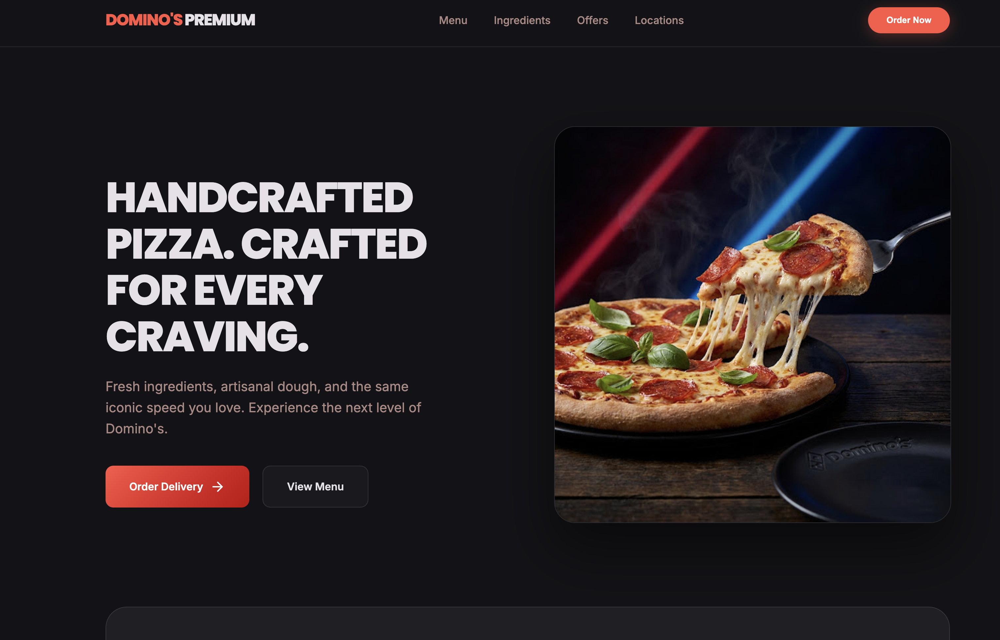

# 🍕 Domino's  Landing Page


A modern, responsive, and visually polished **Domino's Landing Page** built using **HTML5** and **CSS3** as part of **Level 1 - Task 1** for the **Oasis Infobyte Web Development & Design Internship**.

---

# 📸 Landing Page Preview

> Replace the image below with your final project screenshot.



---

# 🚀 Features

- ✅ Sticky Navigation Bar
- ✅ Hero Section
- ✅ Call-to-Action Buttons
- ✅ Statistics Section
- ✅ Featured Pizza Cards
- ✅ Responsive Layout
- ✅ Modern Dark UI
- ✅ Glassmorphism Design
- ✅ Professional Typography
- ✅ Footer with Navigation Links

---

# 🛠️ Tech Stack

| Technology | Purpose |
|------------|---------|
| HTML5 | Structure of the webpage |
| CSS3 | Styling and responsiveness |
| CSS Grid | Responsive page layout |
| Flexbox | Alignment and spacing |
| Google Fonts | Poppins & Inter typography |
| Material Symbols | Modern UI Icons |

---

# 🎨 UI Highlights

- 🌑 Premium Dark Theme
- 🍕 Modern Domino's Concept
- ✨ Glassmorphism Effects
- 🎯 Responsive Design
- 🎨 Consistent Color Palette
- 🖋️ Clean Typography
- 🚀 Smooth Hover Effects
- 📱 Mobile Friendly Layout

---

# 📂 Project Structure

```text
WebDev-L1-LandingPage/
│
├── index.html
├── README.md
└── landing-page.png
```

---

# ✅ Assignment Requirements Covered

- ✔ Fixed / Sticky Navigation Bar
- ✔ Hero Section
- ✔ Two Content Sections
- ✔ Footer
- ✔ Responsive Design
- ✔ HTML5
- ✔ CSS3
- ✔ Consistent Color Palette
- ✔ Clean Typography
- ✔ Mobile Friendly Layout

---

# 👨‍💻 Author

**Kavya Rajput**

🎓 B.Tech Artificial Intelligence & Data Science

💼 Oasis Infobyte Web Development & Design Intern

🔗 GitHub: https://github.com/KAVYA-29-ai

---

# 📜 License

This project was developed for educational purposes as part of the **Oasis Infobyte Internship Program**.

⭐ If you like this project, don't forget to give it a star!
